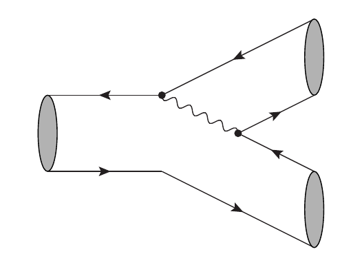
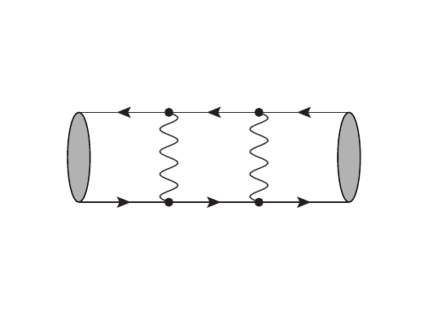

# Feynman diagram drawing

This is wrapper to draw some common feynman diagram topologies for heavy flavour physics.
The wrapper will simply write some `.tex` code which will implement Feynman diagram drawing using the `axodraw` latex package (documentation [here](http://ctan.math.illinois.edu/graphics/axodraw2/axodraw2-man.pdf)).

There is flexibility for labelling bound states and quark / lepton / boson lines.

The currently available topologies are:

- `tree_external` : typical tree level quark flavour transition with an external W
   

- `tree_internal` : typical tree level quark flavour transition with an internal W
   
   
- `loop_external` : typical loop level (penguin) quark flavour transition with an external W loop
   
   
- `loop_internal` : typical loop level (penguin) quark flavour transition with an internal W loop
   
   
- `mixing1` : neutral meson mixing box (with vertical W lines)
   
   
- `mixing2` : neutral meson mixing box (with horizontal W lines)
   
