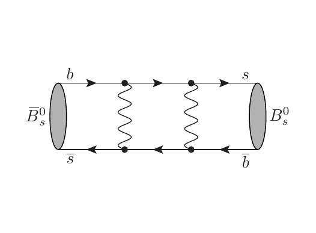
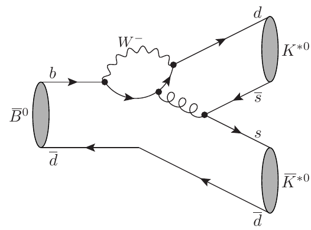
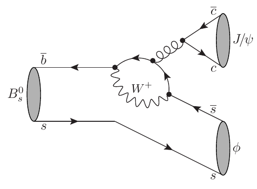
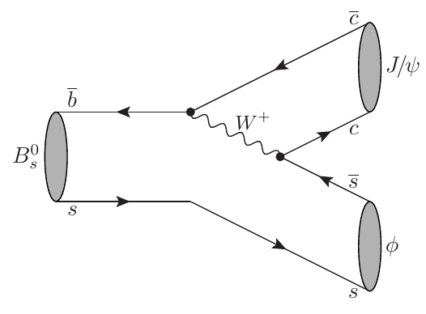
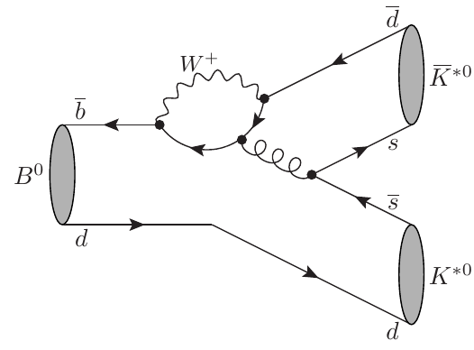
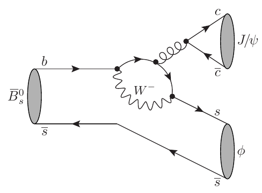
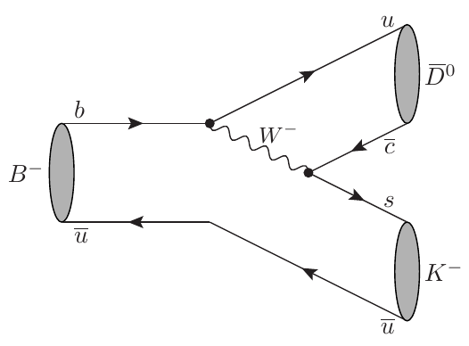
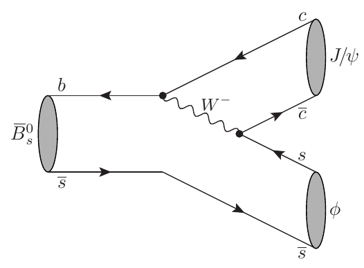

# List of diagrams already available

The following diagrams are available in this directory in .tex, .png and .pdf format.

- `Bs2KstKst`
  
- `BsbMixing2`
  
- `BsbMixing1`
  
- `Bdb2KstKst`
  
- `Bs2JpsiPhi_loop`
  
- `Bp2DzKp`
  
- `Bs2JpsiPhi_tree`
  
- `Bm2DzKm`
  
- `BsMixing2`
  
- `Bsb2KstKst`
  
- `Bd2KstKst`
  
- `Bsb2JpsiPhi_loop`
  
- `BsMixing1`
  
- `Bm2DzbKm`
  
- `Bsb2JpsiPhi_tree`
  
- `Bp2DzbKp`
  
